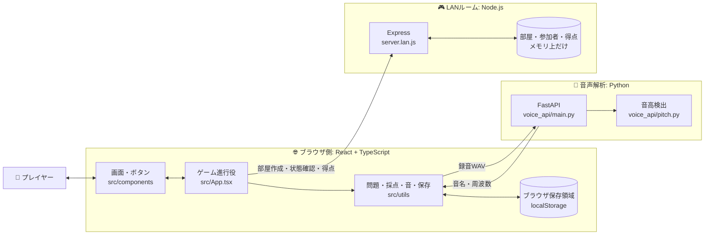
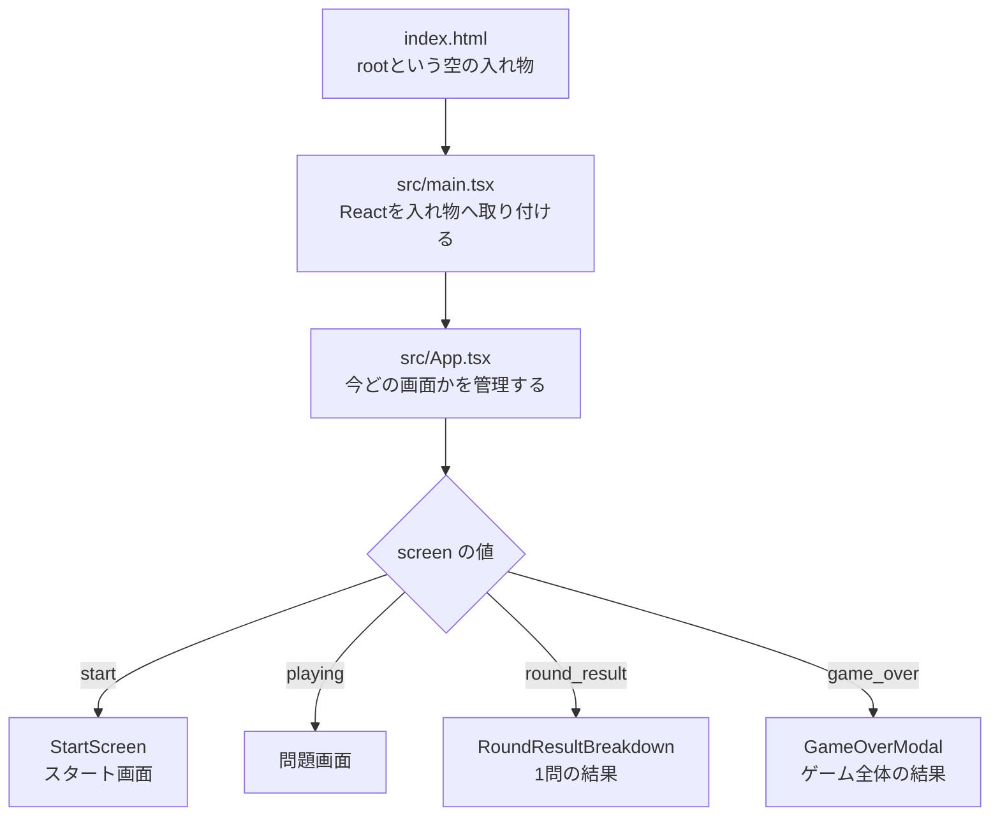
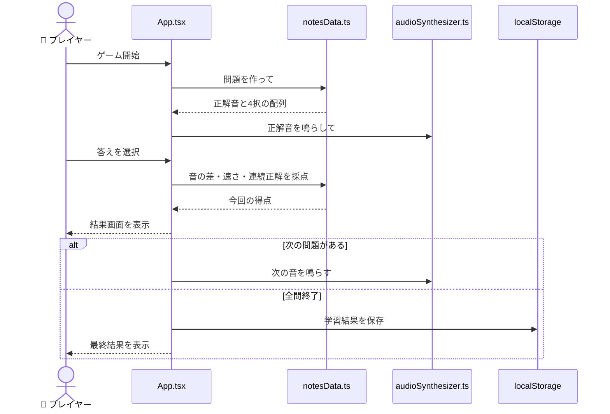
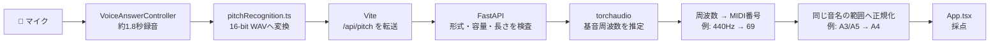
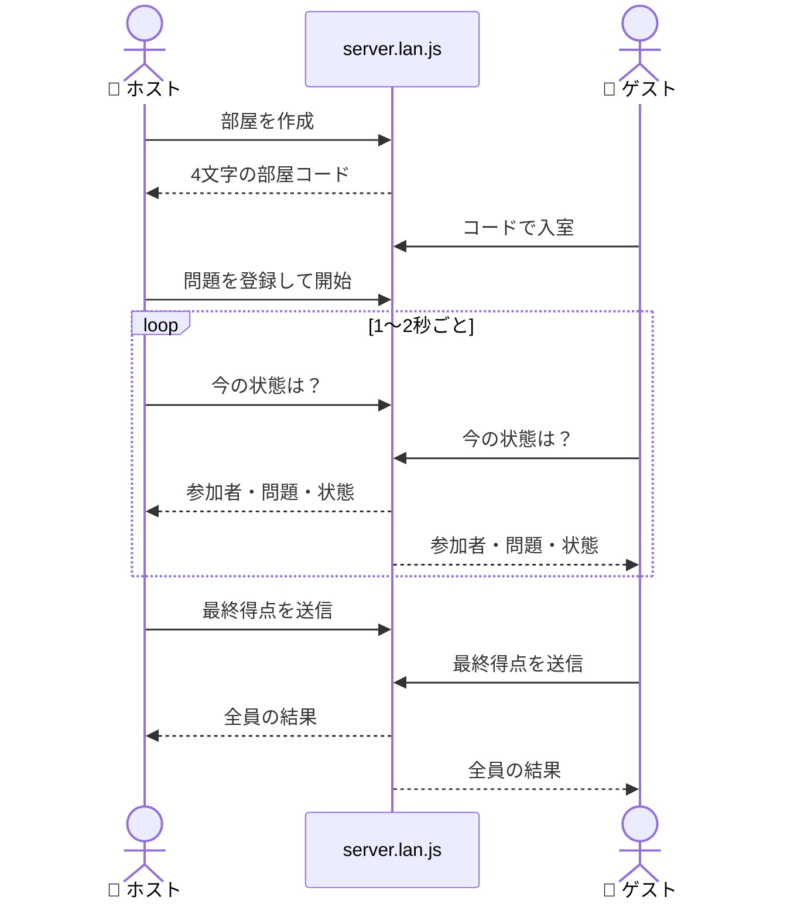
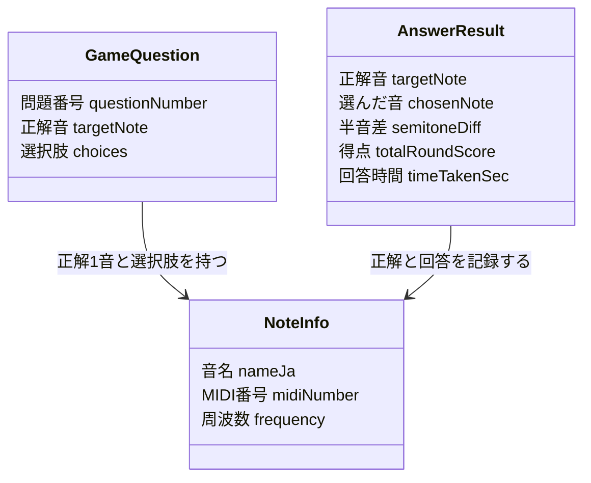

# 音当てピッチマスター — はじめて読む人のためのコード案内

この文書は、プログラミングを始めたばかりの人が「このリポジトリは何をしているのか」「どのファイルから読めばよいのか」をつかむための案内です。

## 1. ひとことで言うと

このアプリは、鳴った音を当てたり、指定された音を自分で歌ったりして、音感を練習するゲームです。

```text
       音が鳴る                  答えを選ぶ                 採点される
    ♪  ～～～>  👂            ド・レ・ミ…  👆           ⭐ +1,420 pt
       C4 = 261.63 Hz          「ドだ！」                  正確さ + 速さ + 連続正解
```

遊び方は大きく3種類あります。

| モード | 何をする？ | 主に動く場所 |
|---|---|---|
| 一人用・選択回答 | 音を聴いて4択から音名を選ぶ | `src/App.tsx` |
| 一人用・音声回答 | 画面に指定された音を歌い、マイクで判定する | `VoiceAnswerController.tsx` + `voice_api/` |
| LAN対戦・協力 | 同じ部屋コードに入り、得点を競う／交代でメロディーを当てる | `BattleMode.tsx` / `CoopMode.tsx` + `server.lan.js` |

## 2. アプリ全体の地図

このリポジトリには、役割の違う3つのプログラムが同居しています。



- React は見た目とゲーム進行を担当します。
- Python は歌声の高さを調べます。通常の4択モードには不要です。
- Node.js のLANサーバーは複数端末の待ち合わせ場所です。一人用には不要です。
- 学習履歴とランキングは外部データベースではなく、そのブラウザの `localStorage` に保存されます。
- LANルームの情報はサーバーのメモリだけにあり、サーバーを再起動すると消えます。

## 3. 起動すると、どのコードから動く？



最初に読む順番は `src/main.tsx` → `src/App.tsx` → 興味のある `src/components/*.tsx` がおすすめです。

`App.tsx` は舞台監督のような存在です。たとえば次のような値（Reactでは「state」と呼びます）を覚えています。

```ts
const [screen, setScreen] = useState<GameScreen>('start');
const [cumulativeScore, setCumulativeScore] = useState<number>(0);
const [currentStreak, setCurrentStreak] = useState<number>(0);
```

- `screen`: 現在の画面
- `cumulativeScore`: 合計点
- `currentStreak`: 連続正解数
- `set...`: 値を更新して画面を描き直すための関数

ボタンを押すと子コンポーネントから `onStartGame` などの関数が呼ばれ、`App.tsx` がstateを変えます。つまり、**データは上から渡し、操作は関数で上へ知らせる**のが基本形です。

## 4. 一人用ゲームの1問が進む仕組み



### 問題作成

`src/utils/notesData.ts` の `ALL_NOTES` が、音についての「名簿」です。

```ts
{
  id: 'A4',
  nameJa: 'ラ',
  midiNumber: 69,
  frequency: 440.0,
  isAccidental: false
}
```

`generateGameQuestions()` は、ここから正解を選び、正解以外の3音を混ぜて4択を作ります。

- 標準: 白鍵の8音（ド〜高いド）
- 上級: シャープを含む13音
- 重複なし: 音の名簿をシャッフルして先頭から使う
- 重複あり: 毎回ランダムに選ぶ

### 採点

得点は足し算です。

```text
1問の得点 = 音の近さ + 速さボーナス + 連続正解ボーナス
```

音の近さはMIDI番号の差で測ります。半音はピアノで隣り合う鍵盤1つ分です。

| 正解との差 | 近さの点 |
|---:|---:|
| 0半音（完全一致） | 1,000点 |
| 1半音 | 700点 |
| 2半音 | 400点 |
| 3半音 | 200点 |
| 4半音以上 | 50点 |

速さボーナスは最大500点で、10秒に近づくほど減ります。ただし、正解から2半音以内のときだけ付きます。

```text
例: 2秒で完全正解、これが2連続正解だった場合
    近さ 1,000 + 速さ 400 + 連続 200 = 1,600点
```

1半音差は連続記録を維持し、2半音以上の差や時間切れは連続記録を0にします。

## 5. 音はどうやって鳴る？

`src/utils/audioSynthesizer.ts` はブラウザ標準の Web Audio API を使います。録音済みのピアノ音源を再生するのではなく、周波数から波を合成して鳴らします。

```text
周波数の数字       波を作る装置          音量・余韻を調整       スピーカー
  440 Hz      →    Oscillator     →       Gain       →       🔊「ラ」
```

たとえばA4（ラ）は440 Hzです。音色を作るために複数の倍音を重ね、音量を時間とともに小さくしてピアノやベルらしい余韻を表現しています。

## 6. 歌声はどうやって音名になる？

音声回答では、ブラウザだけで完結せずPython APIへ録音を送ります。



Python側では、無音や短すぎる声をエラーにし、無音区間を除去し、16 kHzへ揃えてから音高を探します。結果は次のようなJSONでブラウザへ戻ります。

```json
{
  "frequencyHz": 440.0,
  "midiNumber": 69,
  "noteName": "A4",
  "confidence": 0.95
}
```

音声APIが停止中、マイクが不許可、声が小さい、といった失敗は `VoiceAnswerController.tsx` が利用者向けメッセージとして表示します。

## 7. 対戦・協力モードの仕組み

`server.lan.js` はLAN内の端末が共有する小さな掲示板です。WebSocketではなく、各ブラウザが1〜2秒おきに状態を問い合わせる「ポーリング方式」です。



- 対戦 (`BattleMode.tsx`): 全員が同じ単音問題を解き、最終得点を比べます。
- 協力 (`CoopMode.tsx`): メロディーを一度聴き、小節ごとに回答者を交代して音を当てます。
- サーバーに認証はなく、データはメモリ保存です。コード内コメントどおり、ハッカソン／信頼できるLAN向けの簡易構成です。

## 8. ファイル案内

```text
pitch-training/
├── index.html                 Reactを置く入口
├── src/
│   ├── main.tsx               Reactアプリの起動スイッチ
│   ├── App.tsx                一人用ゲーム全体の進行役
│   ├── types.ts               データの「型」の共通ルール
│   ├── index.css              色・大きさ・アニメーション
│   ├── components/            画面を小さな部品に分けたもの
│   └── utils/                 計算・音・保存など見た目以外の処理
├── voice_api/
│   ├── main.py                音声を受け取るAPI窓口
│   ├── pitch.py               音高を検出する計算本体
│   └── test_pitch.py          Python側のテスト
├── server.lan.js              LAN対戦・協力の共有サーバー
├── vite.config.ts             開発サーバーと音声API転送の設定
└── package.json               コマンドと依存ライブラリの一覧
```

主な画面部品は次のとおりです。

| ファイル | 役割 |
|---|---|
| `StartScreen.tsx` | 難易度、問題数、遊び方を選ぶ表紙 |
| `ReferenceToneScreen.tsx` | ゲーム前に基準のド／ラを聴く画面 |
| `SoundPlayerCard.tsx` | 問題音の再生ボタンと音色選択 |
| `ChoicesGrid.tsx` | 4択の回答ボタン |
| `TimerSpeedBar.tsx` | 残り時間の表示 |
| `RoundResultBreakdown.tsx` | 1問ごとの点数内訳 |
| `GameOverModal.tsx` | 全問終了後の結果、苦手問題の再練習 |
| `ResultHistoryModal.tsx` | 過去の学習結果と推移グラフ |
| `BattleMode.tsx` | LAN対戦を一画面で管理 |
| `CoopMode.tsx` | LAN協力プレイを一画面で管理 |

## 9. データの「型」は設計図

`src/types.ts` は、アプリ内で受け渡すデータの形を決めています。TypeScriptの型は、荷物に貼る内容物ラベルのようなものです。



型があることで、たとえば周波数が必要な場所へ文字列だけを渡す間違いを、実行前に見つけやすくなります。

## 10. 保存されるもの／されないもの

| データ | 保存場所 | ブラウザを閉じた後 | 別端末との共有 |
|---|---|---|---|
| 学習履歴 | `localStorage` | 残る | されない |
| 一人用ランキング | `localStorage` | 残る | されない |
| LANの部屋・参加者・得点 | Node.jsのメモリ | サーバー再起動で消える | LAN参加者で共有 |

`resultStorage.ts` は保存データを読み出すときに型・数値・日付を検証します。同じゲームIDがすでに存在する場合は二重保存しません。

## 11. テストは「変更しても壊していない」ことを確かめる安全網

テストファイルは `*.test.ts` と `voice_api/test_pitch.py` です。

```bash
# TypeScriptのロジックテスト
npm test

# TypeScriptの型チェック
npm run lint

# 本番用に組み立てられるか確認
npm run build

# Python音声解析のテスト（仮想環境を作成済みの場合）
.venv/bin/python -m unittest voice_api.test_pitch
```

主に次を守っています。

- 問題数や4択が正しく作られること
- 半音差、速さ、連続正解の点数が正しいこと
- 音声解析結果のMIDI番号を対象音域へ直せること
- 保存データが壊れている場合に見逃さないこと
- 無音や短い録音を音として誤認しないこと

## 12. 初心者におすすめの読み方・変更の練習

1. `src/types.ts` で登場人物（データの形）を知る。
2. `src/utils/notesData.ts` で音の名簿と採点規則を読む。
3. `src/App.tsx` で `screen` を検索し、画面遷移を追う。
4. `StartScreen.tsx` や `ChoicesGrid.tsx` で、propsとクリック処理を見る。
5. 変更後は `npm test && npm run lint && npm run build` を実行する。

最初の改造には、次のような小さな変更が向いています。

- 制限時間を変える: `App.tsx` の10秒という値と、問題データの `timeLimitSec` を一つの定数へまとめてから変更する。
- 採点を変える: `notesData.ts` の採点関数と、そのテストをセットで変更する。
- 音を追加する: `ALL_NOTES` に追加し、標準／上級の対象範囲と音声認識の正規化範囲も確認する。
- 新しい画面を足す: `GameScreen` 型へ名前を追加し、`App.tsx` で表示条件と移動方法を追加する。

## 13. 覚えておくと読みやすい用語

| 用語 | このプロジェクトでの意味 |
|---|---|
| コンポーネント | 画面を構成する再利用可能な部品 |
| props | 親部品から子部品へ渡すデータや関数 |
| state | 画面が現在覚えている、変化する値 |
| hook | `useState` や `useEffect` などReactの仕組み |
| API | 別プログラムとデータを受け渡す窓口 |
| MIDI番号 | 音の高さを半音ごとの整数で表した番号 |
| Hz（ヘルツ） | 1秒間の振動回数。大きいほど高い音 |
| ポーリング | 一定間隔でサーバーへ最新状態を問い合わせる方式 |
| localStorage | ブラウザ内に文字列データを保存する場所 |

---

このコードを理解するいちばん大切な視点は、**画面 (`components`)・進行 (`App.tsx`)・計算 (`utils`)・外部処理 (`voice_api` / `server.lan.js`) が役割分担している**ことです。迷ったときは「これは見た目、ゲーム進行、計算、通信のどれか？」と分類すると、読む場所を見つけやすくなります。
